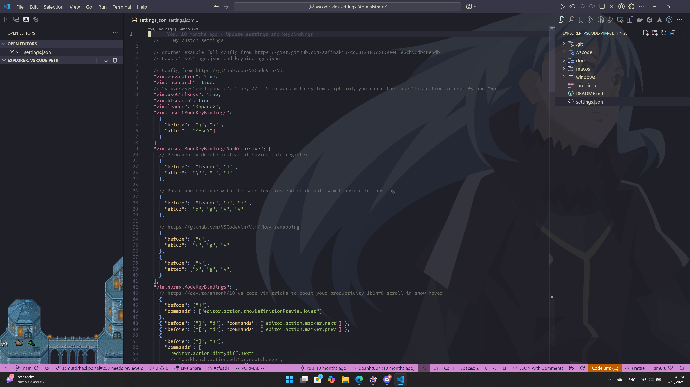

# VSCode Vim Settings



This is the repo for my collections of useful Vim shortcuts and bindings for VSCode.

My goal is to keep it as simple as possible, so we can stick with Vim Motions for the most part.

But of course, I have added some of my preferences for VSCode.

- `settings.json`: This is for `Preferences: Open User Settings (JSON)`

- `keybindings.json`: This is for `Preferences: Open Keyboard Shortcuts (JSON)`

There are 2 guides:

- One for machines with `Cmd` key: [MacOS](./docs/macos-keyboard.md)
- The other for machines with no `Cmd` key: [Windows](./docs/windows-keyboard.md)

## Resources to learn Vim Motions

- For some references, I practiced Vim by doing `vimtutor` on Mac Terminal. I think this exists on Windows too.

- I also watch some parts of the series `Vim as your editor` on Youtube by `ThePrimeagen`

## Cool extensions with VS Code

- Vim: Vim emulation for VSCode

- For cool themes:

  - Bearded Theme
  - Kanagawa
  - Catpuccin

- Material Icon Theme: For icon themes

- Bookmarks: For bookmarks

- Codeium: Free AI coding autocomplete

- Markdown All in One: For better support for markdown file editing

## Cool layout for VS Code

To maximize productivity with VS Code, I use the following layout:

- `Primary Side Bar` is on the `right`
- `Secondary Side Bar` is on the `left`
- I drag `Open Editors` and `Outline` to `Secondary Side Bar`
- I also hide `Filters` in `Explorer`

This is totally optional as it is my preference

## Issue with CRLF + LF and Git on Windows

- https://stackoverflow.com/questions/2517190/how-do-i-force-git-to-use-lf-instead-of-crlf-under-windows

- Do these before pulling or cloning anything

```bash
git config --global core.autocrlf false
git config --global core.eol lf
```

- If you already have previous projects, you can manually fix line endings like below strategies

### Prettier

---

- Then you can install `prettier` globally
- Run `prettier --write .` with this `.prettierrc` to fix all files/folders in the current directory

```json
{
  "endOfLine": "lf"
}
```

- But `prettier` can sometimes not work out of box for some file types unless you install extra plugins with it

---

- So we can also use `dos2unix`

### Simple dos2unix

```powershell
Get-ChildItem -Recurse -File | ForEach-Object { dos2unix $_.FullName }
```

### Complicated dos2unix

- To avoid stuff in gitignore

```powershell
# Read .gitignore and create an array of ignored patterns
$gitignorePath = ".gitignore"
$ignoredPatterns = Get-Content $gitignorePath | Where-Object { $_ -notmatch "^#|^$" }

# Function to check if a file matches any ignored pattern
function IsIgnored($filePath) {
    foreach ($pattern in $ignoredPatterns) {
        if ($filePath -like $pattern) {
            return $true
        }
    }
    return $false
}

# Recursively find all files and convert them to LF line endings
Get-ChildItem -Recurse -File | ForEach-Object {
    $relativePath = $_.FullName.Substring((Get-Location).Path.Length + 1)
    if (-not (IsIgnored $relativePath)) {
        dos2unix $_.FullName
    }
}
```

---
